# Fintech Credit Card Churn Prediction

## Overview

A bank is experiencing an increasing rate of credit card customer churn. The goal of this project is to build and
compare three machine learning classifiers to predict customer attrition:

1. Single Decision Tree classifier
2. Random Forest classifier
3. Neural Network classifier

The dataset (`Dataset1.xlsx`) contains 10,127 rows and 18 features, including demographic variables (age, gender,
education, marital status, income category), product information (card category, months on book, total relationship
count), activity metrics (transactions, revolving balances, utilization ratios), and the target variable
`Attrition_Flag` (Existing vs. Attrited Customer).

The python notebooks produced should be viewed in order:

* `preprocess.ipynb`: Data preprocessing
* `trees.ipynb`: Decision Tree and Random Forest models + interpretability results
* `nn.ipynb`: Neural Network model

The details of the analysis can be found in the notebooks, below is an overview of the key steps and findings.

## Data Preprocessing

The `preprocess.ipynb` notebook performs data-quality checks and feature reduction:

* **Duplicates & Constant Features:** No duplicate rows or zero-variance features were found.
* **Categorical Cardinality:** Checked features with few unique values: all categorical features have acceptable
  cardinality.
* **Missing & Zero Values:** No nulls detected. Columns where zero is meaningful (e.g., `Dependent_count`) were
  retained.
* **Outliers & Correlations:** Examined outliers and pairwise feature correlations.
    * No significant outliers were found.
    * Removed derived columns: `Avg_Open_To_Buy` (`Credit_Limit - Total_Revolving_Bal`) and `Avg_Utilization_Ratio` (
      `Total_Revolving_Bal / Credit_Limit`).<br>
    * Dropped `CLIENTNUM` to avoid overfitting.
    * Saved the modified dataset as `credit_card_customers.csv` for future use.
* **PCA:** A 2D PCA scatterplot shows some separation between attrited and existing customers. Shown just for reference:

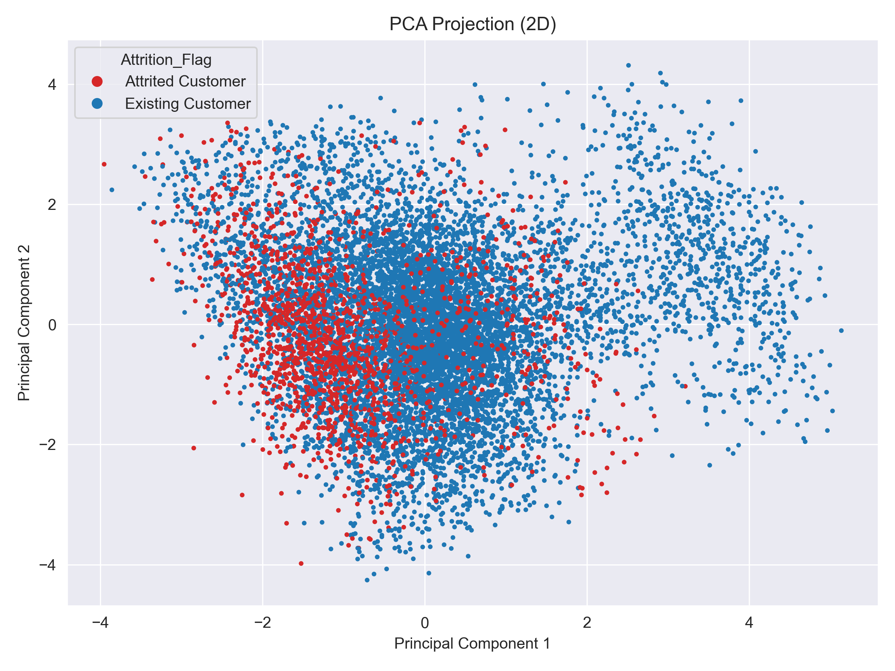

---

## Decision Tree & Random Forest Models

### Data Preparation

Tree-based models handle numeric features directly and require ordinal encoding for categorical variables. I applied a
custom `OrdinalEncoder` to reflect natural ordering where appropriate (income category, education level), leaving
numeric columns unscaled.

### Decision Tree Classifier

I used `GridSearchCV` to tune hyperparameters (e.g., `max_depth`, `min_samples_split`) via cross-validation on the
training set. Here's the confusion matrix and the metrics:

```
Decision Tree
Accuracy : 0.937
Precision: 0.878
Recall   : 0.708
F1-score : 0.784
ROC-AUC  : 0.966
```

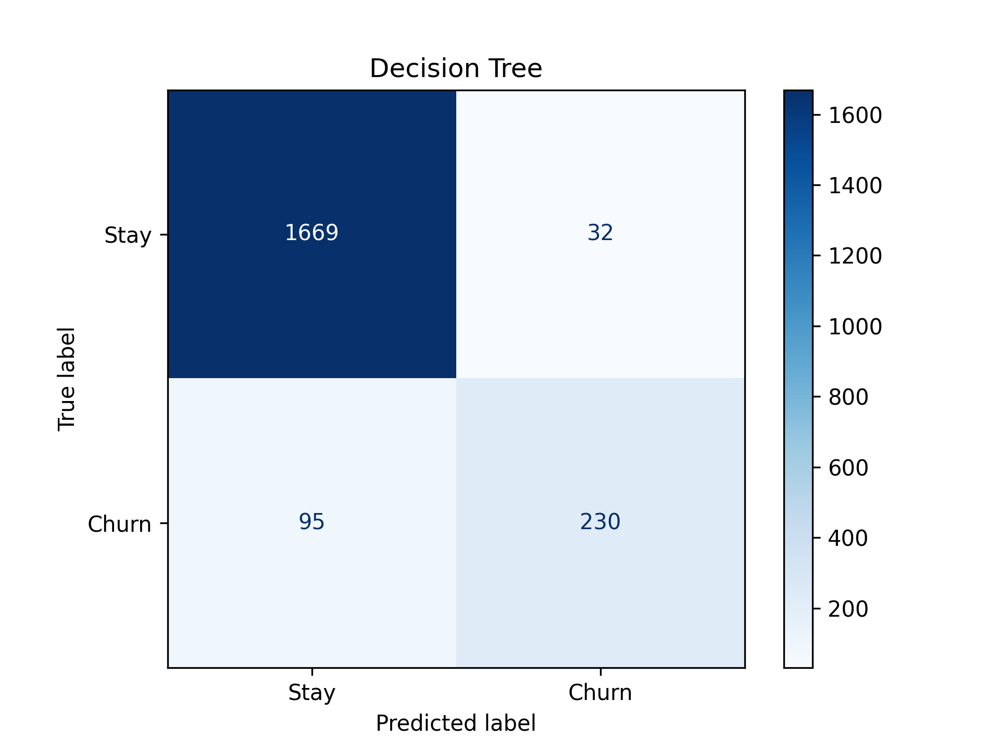

### Random Forest Classifier

A `RandomForestClassifier` with 400 trees was also tuned using `GridSearchCV`. On the test set, it
outperformed the single tree in ROC AUC (being 0.991) and $F_1$ score:

```
Random Forest
Accuracy : 0.958
Precision: 0.951
Recall   : 0.775
F1-score : 0.854
ROC-AUC  : 0.991
```

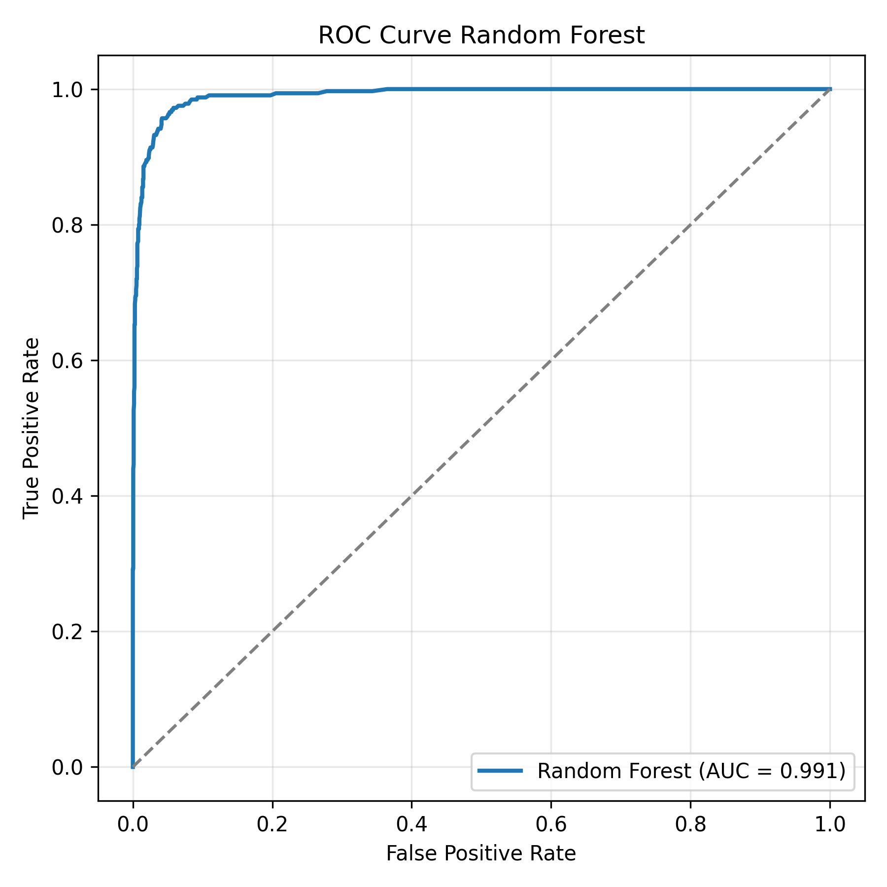


### Threshold Tuning

As expected, the random forest classifier performs better than the decision tree classifier.

However, in the confusion matrix, the number of falsely predicted to stay (who really churned) is lower than the number
of falsely predicted to churn (aka recall < precision). Is that better or not depends on the end-goal.

Since we are interested in determining and doing something with people who are about to churn (giving them some benefits
etc.), in my opinion, recall is more important to us.  
Because predicting that the churn-client stays (=> we lose a client) is worse than predicting that the stay-client
churns (=> we lose the extra benefists given).

This is why I tweaked the threshold to increase the recall.  
I chose the threshold that maximizes the F2 score, which prioritizes recall over precision.

This reduced the number of churned customers misclassified as retained to just 14, which, in my opinion, is a good
trade-off.

```
Best threshold (max-F2): 0.215
Accuracy : 0.958
Precision: 0.814
Recall   : 0.957
F1-score : 0.880
F2-score : 0.924
```

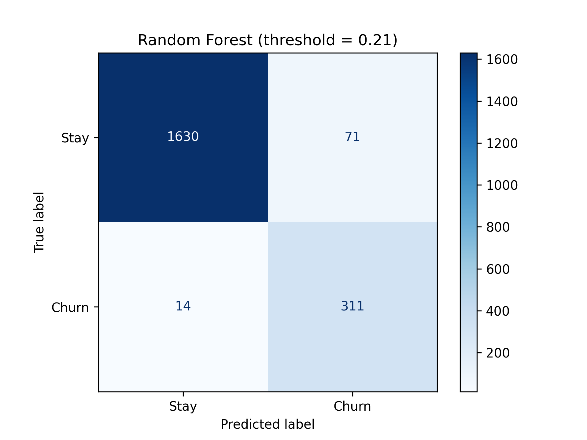

### Interpretability

#### **Decision Tree visualization:**

* In the tree below, blue nodes represent customers who are likely to leave, while orange nodes represent customers
  who are likely to stay.
* The image suggests that the Total Transactions Count is the most important feature for the decision tree
  classifier.

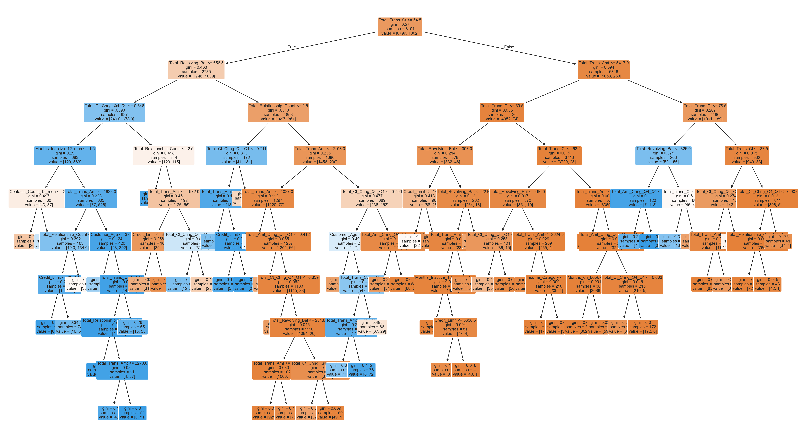

#### **Feature Importances (Gini):**

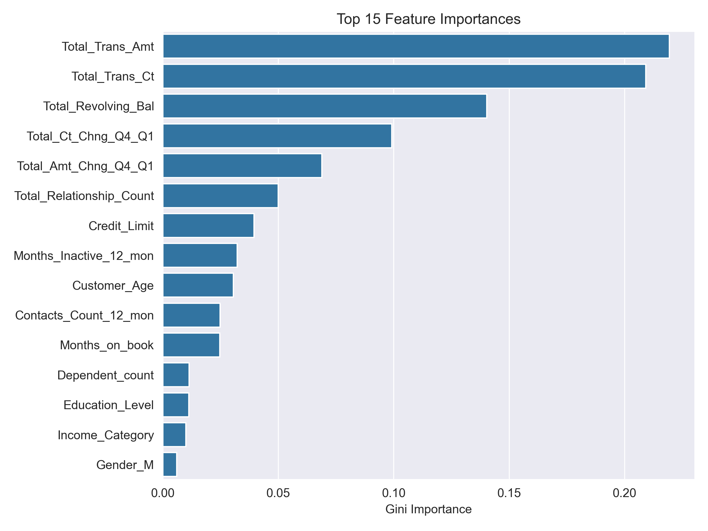

* The Gini importance graph confirms that the most important features are total transaction count and total
  transaction amount.
* Customers who use the card a lot are engaged and they almost never leave. Low amount of transactions is an
  early-warning signal.
* Also those who started using the card more frequently in Q4 or have a high credit limit are maybe less likely to
  churn.
* These Gini importances don't necessary mean that the model depends on, for example, Total Transactions Amount,
  monotonic (higher => less churn). Maybe there are just certain spots within spending where churn rate is lower.
* I plot the PDPs to show the exact relationship between the features and churn rate.

#### **PDPs:**

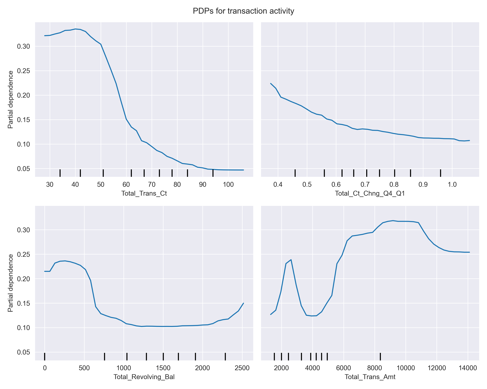

The PDPs show the relationship between the features and churn rate:

* The more transactions you have, the less likely you are to churn.
* The same applies to the `Total_Ct_chng_Q4_Q1` feature, which is the change in the number of transactions in Q4
  compared to Q1. <br>
* Total revolving balance is a bit trickier. Low balance means high churn rate, then there's a steep drop to a
  plateau, and in the very end it starts to rise a bit again. It's worth noting that the highest amount of balance
  in the dataset is 2517, and as many as 508 people have it, which is odd. Maybe the data was clipped or there has
  been an error in the data collection process. This has to be confirmed and until then the rise and the end of the
  plot is not reliable.
* The total transaction amount plot is also non-monotonic. The data shows that the most loyal customers are those
  who spend a moderate amount of money, between 3000 and 5000. People who spend nothing may have just gotten the
  card, which explains the low partial dependence value in the beginning of the plot. The probability also goes down
  for those who spend more than 12000.

#### **Permutation Feature Importance:**

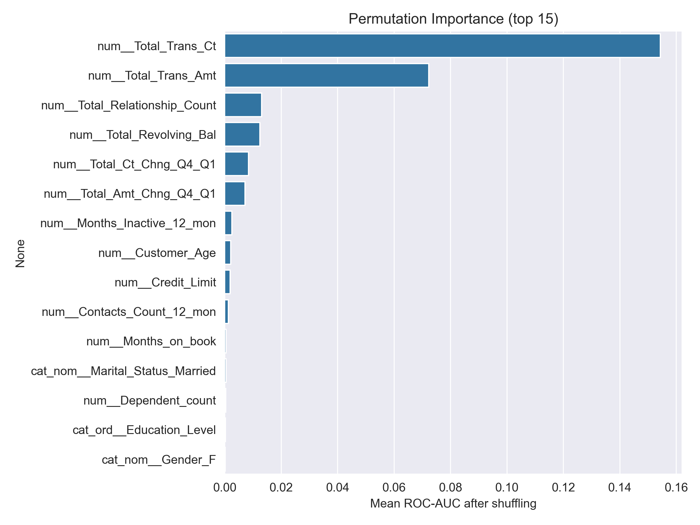

The permutation feature importance confirms the Gini importances:  
The most important features are Total Transactions Count and Amount.

#### **Partial Dependence & Scatter Analysis:**

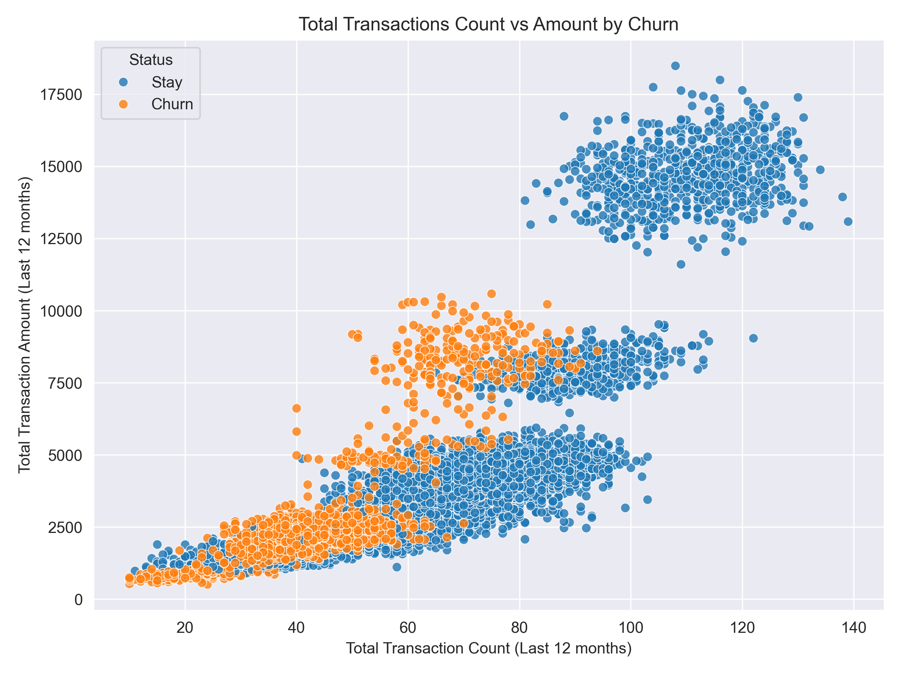

* It is clear that the cluster of clients with >80 transactions and >12000 amount is the most loyal.
* The cluster of medium-amount clients clearly shows that the amount of the transactions is very important (more
  tx => less churn).
* The lowest-amount cluster also depicts the `higher => less churn` tendency. The classes can't be separated
  straightaway but the other 16 features help with that.
* That explains the classifier being so good at predicting churn, because the data is very informative even with two
  features.

#### **Churn rates by category**:

* Gender: Women churn slightly more than men.
  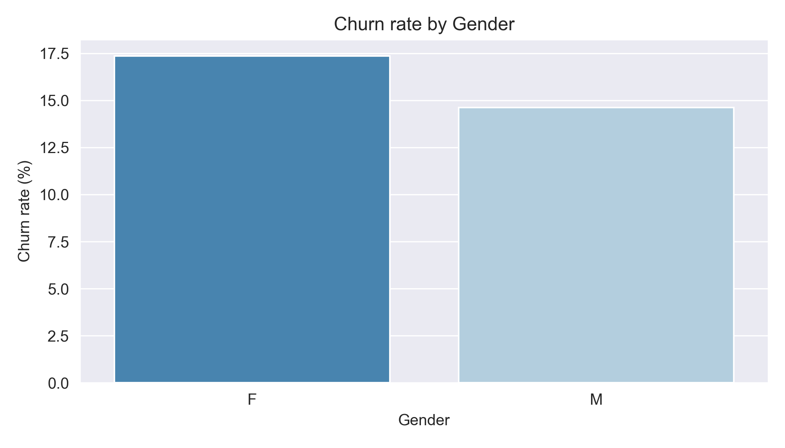
* Marital Status: Married clients are less likely to churn, which is logical, since they have a more stable
  financial situation.
  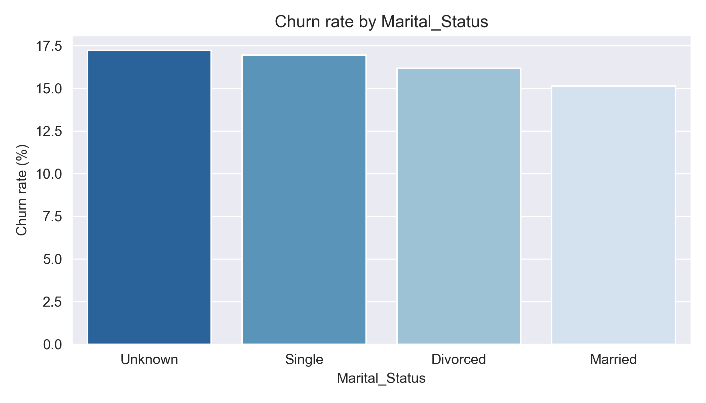
* Income: The results are quite mixed, no wonder `Income_Category` is not one of the most import features in the
  model. However, the highest income category (120K+) also has the highest churn rate.
  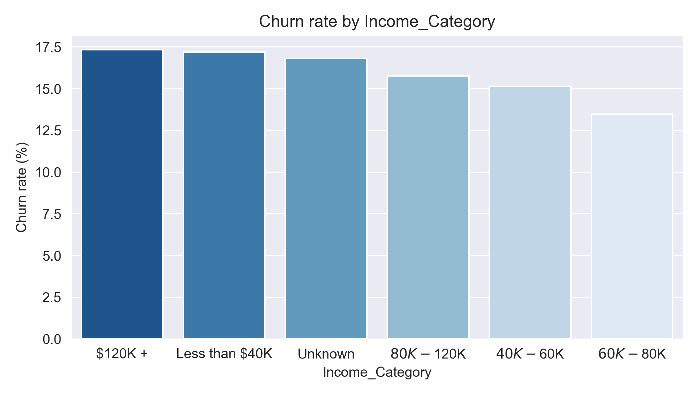
* Education Level: The plot shows that clients with higher education are more likely to churn. In other words,
  doctors are smart and prefer using debit cards (as you should from a personal finance perspective). But not from
  the bank perspective, so the bank should think about how to retain those clients (maybe by providing some features
  that this group needs).
  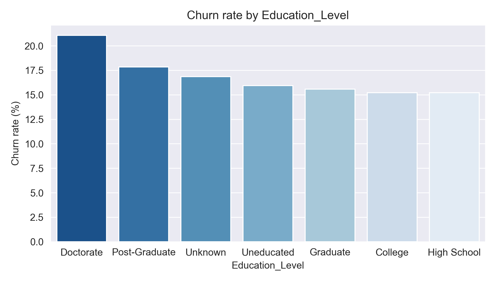
* Card Category: Platinum card holders are less loyal, which is surprising. However, those are only 20 people in the
  dataset so the results are not reliable.
  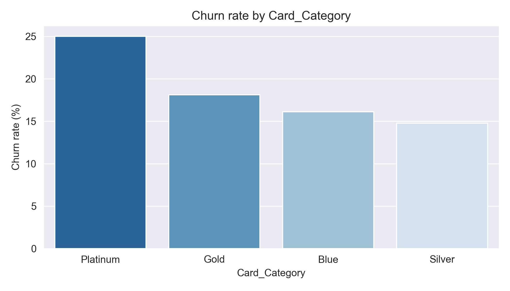

---

## Neural Network Model

### Data Preparation

Numerical features were scaled (`StandardScaler`) and categorical features were one‑hot encoded.

### Model Architecture & Training

A simple neural network was built using Keras with the following architecture:

* Input layer with 18 features
* Dense hidden layer with 256 neurons and sigmoid activation
* Dropout layer (0.1)
* Dense output layer with 64 neurons and sigmoid activation
* Dropout layer (0.1)
* Dense output layer with 1 neuron and sigmoid activation

I used dropout inbetween the layers to prevent overfitting and use the `sigmoid` activation function in the output
layer,
producing a single probability `P(churning)`.

### Training

The model was trained for 500 epochs with early stopping with patience of 25 based on validation loss.

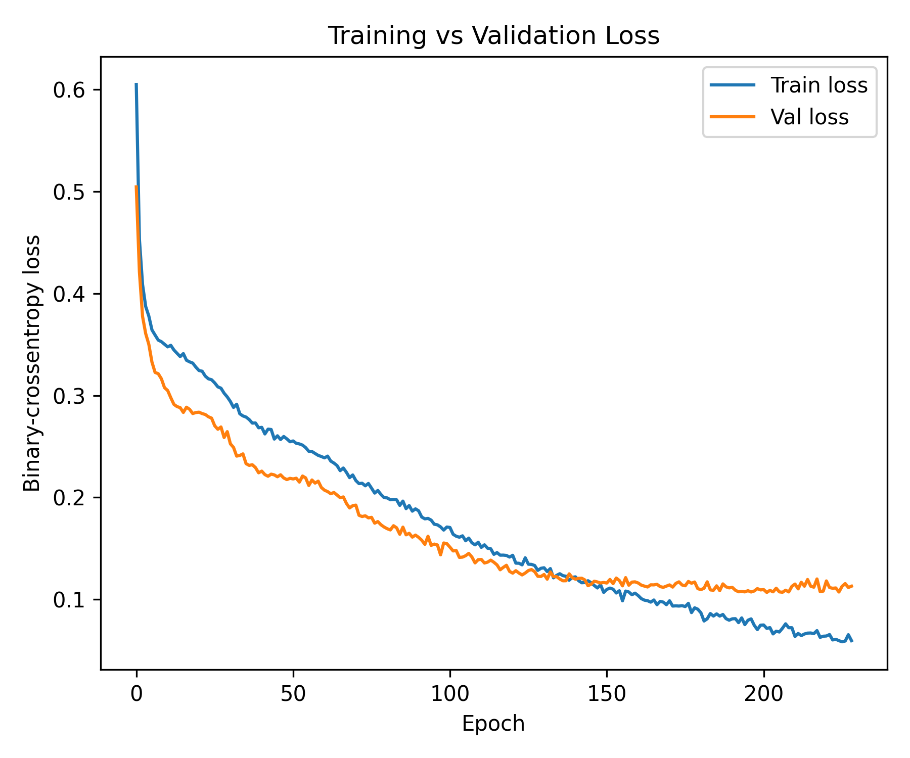

### Evaluation & Threshold Tuning

* **ROC AUC:** 0.990, comparable to tree-based models.

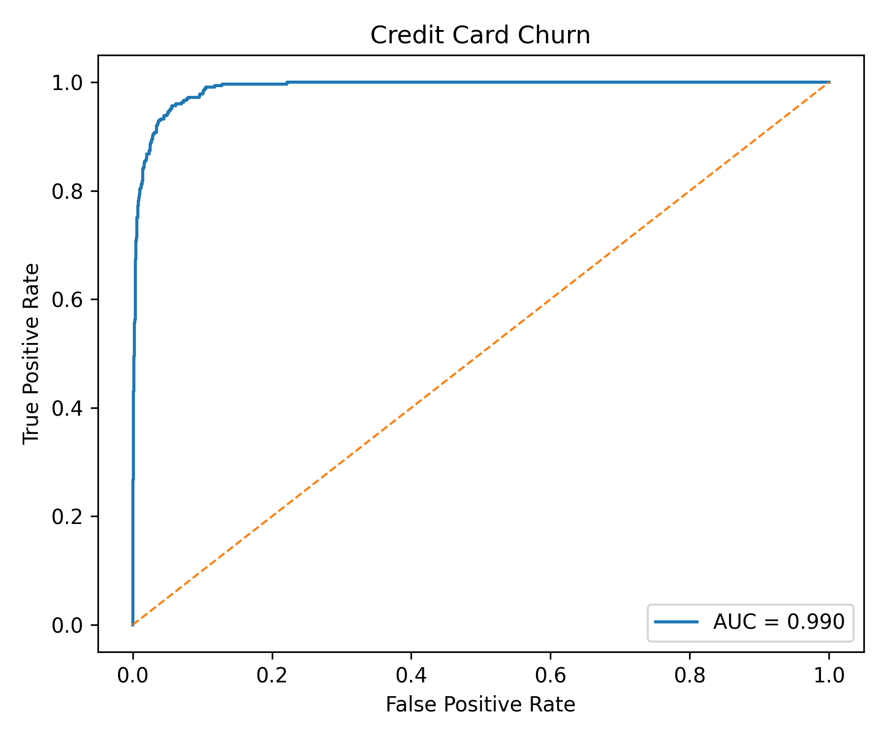

* **Confusion Matrix (Default Threshold):** The default threshold of 0.5 resulted in these results:

```
Accuracy : 0.960
Precision: 0.865
Recall   : 0.889
F1-score : 0.877
ROC-AUC  : 0.990
```

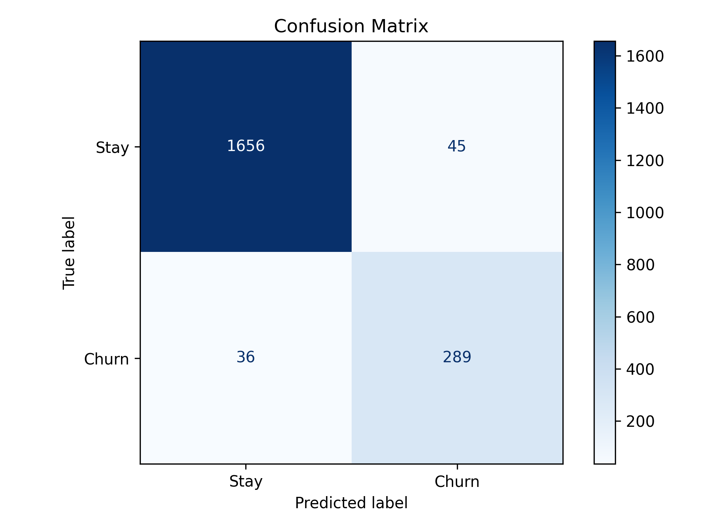

* **Threshold Optimization:** Selected the threshold maximizing $F_2$ to prioritize recall over precision:

```
Best threshold (max-F2): 0.160
Accuracy : 0.946
Precision: 0.764
Recall   : 0.957
F1-score : 0.850
F2-score : 0.911
```

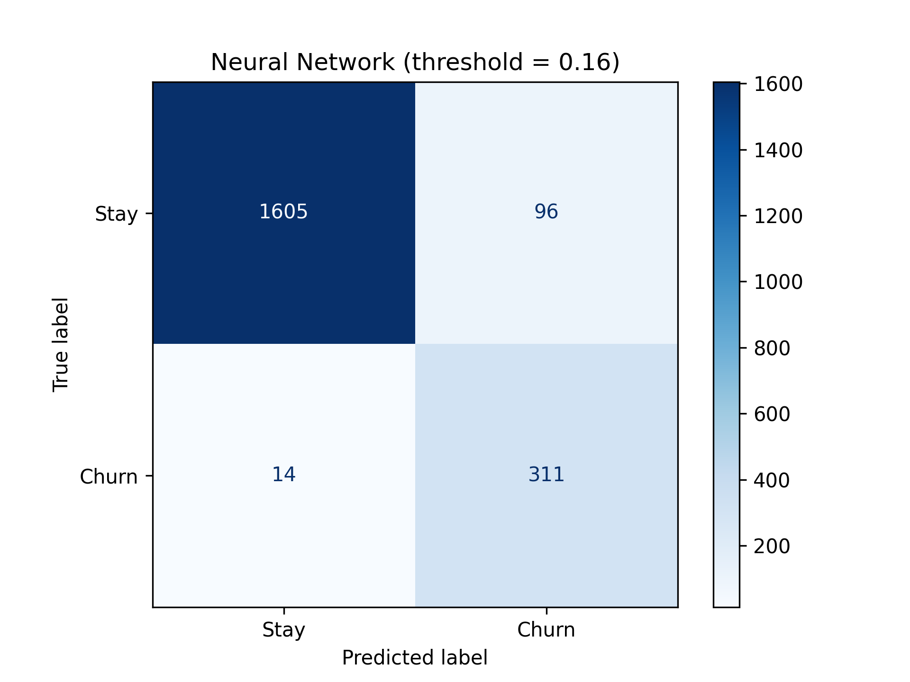

The tweaked model is slightly worse than the random forest model, it labeled just 25 more clients as falsely churning.

It is much harder to interpret the neural network model, thats why I did it using the tree-based models.

---

## Conclusion & Recommendations

* **Best Model:** The Random Forest classifier slightly outperforms both the single Decision Tree and the Neural Network
  in recall and overall ROC AUC, while still providing clear interpretability.

* **Key Features:** Total transaction count and total transaction amount are the strongest predictors of
  customer retention.

* **Advices for the Bank:**
    * Use the Random Forest model to identify at-risk customers based on their features.
    * Monitor customers with low transaction frequency or low spending as early warning signals.
    * Prioritize targeted retention offers to single, highly educated or high-income clients showing declining activity.
